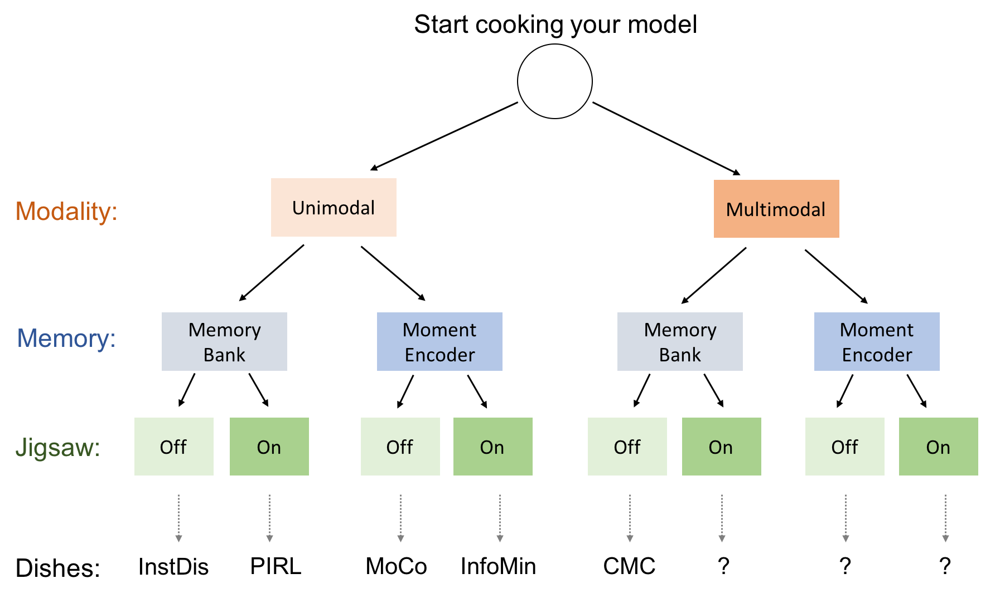

## PyContrast

### Introduction
Recently, contrastive learning approaches have significantly advanced the SoTA of 
unsupervised (visual) representation learning. This repo contains pytorch 
implementation of a set of (improved) SoTA methods using the same training and 
evaluation pipeline. 

It supports multi-node distributed training (e.g., 32 GPUs across 4 machines) and 
the mixed precision feature.

### Contents
**(1) For now, it covers the following methods as well as their combinations 
(the order follows the forward time arrow):**

- Unsupervised Feature Learning via Non-parameteric Instance Discrimination
  [[pdf]](https://arxiv.org/pdf/1805.01978.pdf) 
  - Zhirong Wu, Yuanjun Xiong and X Yu Stella and Dahua Lin.
  
- Contrastive Multiview Coding.
  [[pdf]](https://arxiv.org/abs/1906.05849) 
  - Yonglong Tian and Dilip Krishnan and Phillip Isola.

- Momentum Contrast for Unsupervised Visual Representation Learning
  [[pdf]](https://arxiv.org/pdf/1911.05722.pdf)
  - Kaiming He, Haoqi Fan, Yuxin Wu, Saining Xie, Ross Girshick.

- Self-Supervised Learning of Pretext-Invariant Representations
  [[pdf]](https://arxiv.org/abs/1912.01991)
  - Ishan Misra, Laurens van der Maaten.

- Improved Baselines with Momentum Contrastive Learning
  [[pdf]](https://arxiv.org/pdf/2003.04297.pdf)
  - Xinlei Chen, Haoqi Fan, Ross Girshick, Kaiming He

- What Makes for Good Views for Contrastive Learning?
  [[pdf]](https://arxiv.org/pdf/2003.04297.pdf)
  - Yonglong Tian, Chen Sun, Ben Poole, Dilip Krishnan, Cordelia Schmid, Phillip Isola 

**(2) The following figure illustrates the similarity and dissimilarity between these methods, 
in terms of training pipeline. Question mark `?` means unreported methods which are also supported.**

  

### Install Environments
Please see [INSTALL.md](docs/INSTALL.md).

### Running
For training and testing different models, please see [RUN.md](docs/RUN.md).

### Model Zoo
For pre-trained models and results, please check [MODEL_ZOO.md](docs/MODEL_ZOO.md)

